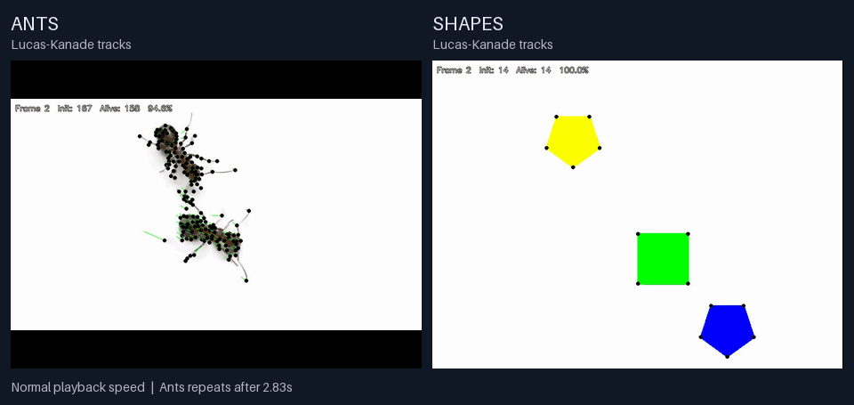

# Optical Flow Tracker

A Python/OpenCV project for exploring motion with **Lucas–Kanade feature tracking** and **Farnebäck dense optical flow**. Follow point trajectories, visualize motion direction, and extract moving regions from video.



*Ants on the left, geometric shapes on the right. Both previews use the generated Lucas–Kanade tracking videos at their original playback speed; the shorter ants clip loops during the comparison.*

## What it does

- Detects Shi–Tomasi corners and follows them with pyramidal Lucas–Kanade optical flow.
- Draws point trajectories and reports how many tracks remain active.
- Estimates dense Farnebäck flow, with direction encoded as hue and per-frame normalized magnitude as brightness.
- Builds motion masks using a magnitude threshold, morphological filtering, and connected-component area filtering.
- Exports annotated videos, representative frames, track-survival plots, and summary metrics.

The included clips show two different tracking conditions: clean geometric boundaries and deforming, overlapping ants. This tracks image features; it does not detect individual ants or assign persistent object identities.

## Quick start

Use **Python 3.10 or newer**. Run these commands from the repository root:

```bash
git clone https://github.com/ainazarov/optical-flow-tracker.git
cd optical-flow-tracker
python -m venv .venv
```

Activate the environment:

```bash
# macOS / Linux
source .venv/bin/activate
```

```powershell
# Windows PowerShell
.\.venv\Scripts\Activate.ps1
```

Install the dependencies and open the notebook:

```bash
python -m pip install -r requirements.txt
jupyter lab optical_flow.ipynb
```

Choose **Run → Run All Cells**. The two sample clips in `in_videos/` are processed automatically, and results are written to `out/`.

For a complete run without opening Jupyter:

```bash
jupyter nbconvert --to notebook --execute optical_flow.ipynb --output executed --output-dir out --ExecutePreprocessor.timeout=600
```

## Configuration

Edit the configuration cell at the top of [optical_flow.ipynb](optical_flow.ipynb). Add your own video paths to `VIDEO_LIST` to process other clips.

| Setting | Default | Purpose |
| --- | --- | --- |
| `VIDEO_LIST` | Shapes and ants sample clips | Input videos |
| `OUT_DIR` | `out` | Generated results directory |
| `MAX_FRAMES` | `150` | Maximum input frames, including the initial reference frame |
| `RESIZE_WIDTH` | `960` | Processing width; aspect ratio is preserved |
| `FPS_OUT` | `30` | Playback frame rate of generated videos |
| `GAUSS_BLUR` / `USE_CLAHE` | `(5, 5)` / `True` | Grayscale smoothing and local contrast enhancement |
| `GFTT_PARAMS` | Up to `500` corners | Feature detection settings |
| `LK_ERR_THRESH` / `LK_MAX_JUMP` | `20.0` / `60.0` | Reject unreliable matches and large inter-frame jumps |
| `REDETECT_PCT` | `0` | Re-detect features below this fraction of the initial count; `0` disables it |
| `FB_PARAMS` | See notebook | Farnebäck pyramid and neighborhood settings |
| `MAG_THRESH` | `1.5` | Motion threshold in pixels per processed frame pair |
| `MORPH_KERNEL` / `MIN_COMPONENT_AREA` | `5` / `150` | Motion-mask cleanup |

`FPS_OUT` controls playback, independently of the input video's frame rate. Displacements are measured between consecutive input frames after resizing. Flow visualizations normalize brightness separately in each frame, so brightness is not an absolute speed scale across frames or videos.

## Outputs

The initial frame seeds the tracker; each subsequent frame produces one output frame. For a clip with `N` readable frames, the default run writes up to `min(N, MAX_FRAMES) - 1` frames.

| Path | Contents |
| --- | --- |
| `out/videos/<clip>/lk_tracks.avi` | Original frames with tracked trajectories |
| `out/videos/<clip>/farneback_flow.avi` | Dense flow visualization |
| `out/videos/<clip>/motion_mask.avi` | Cleaned binary motion masks |
| `out/pictures/<clip>/` | Sample frames and a track-survival plot |
| `out/<clip>_metrics.txt` | Frame count, active tracks, average survival, track length, and motion-mask statistics |

Generated outputs are ignored by Git. The README GIF is kept separately in `docs/assets/`.

## Rebuild the preview

After running the notebook:

```bash
python -m pip install -r requirements-preview.txt
python scripts/make_preview.py
```

The script combines the two `lk_tracks.avi` outputs into `docs/assets/lk-tracks.gif`, preserves their aspect ratios, and loops the shorter clip. Run `python scripts/make_preview.py --help` for options.

## Project layout

```text
optical_flow.ipynb        Tracking pipeline and visual analysis
in_videos/               Sample input clips
docs/assets/             README animation
scripts/make_preview.py  Reproducible preview generation
requirements.txt         Notebook dependencies
requirements-preview.txt Additional preview dependencies
out/                     Local generated results (ignored by Git)
```

## Reading the results

On simple shapes, corners provide clear features to track. The ants clip exposes harder conditions: occlusion, deformation, fine moving limbs, and features leaving the frame. Inspect the notebook's survival curves and trajectory plots to see where tracking degrades.

The motion mask identifies regions with estimated motion, rather than complete object silhouettes. Low-texture interiors may remain dark, and nearby moving regions may merge. These are exploratory diagnostics without ground-truth labels; track survival and mask area do not measure tracking accuracy.
